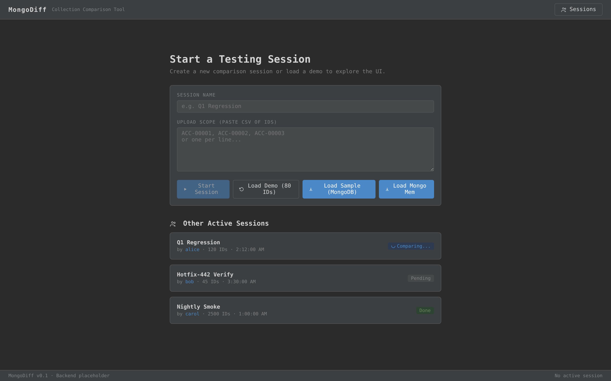
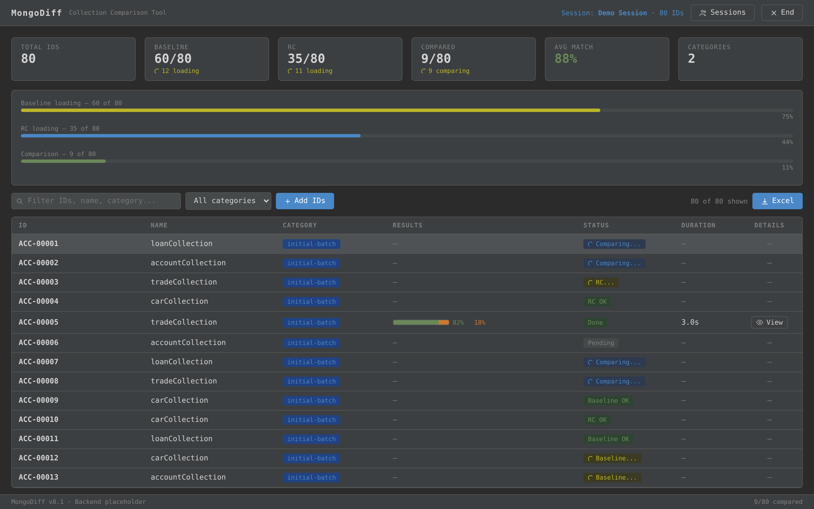
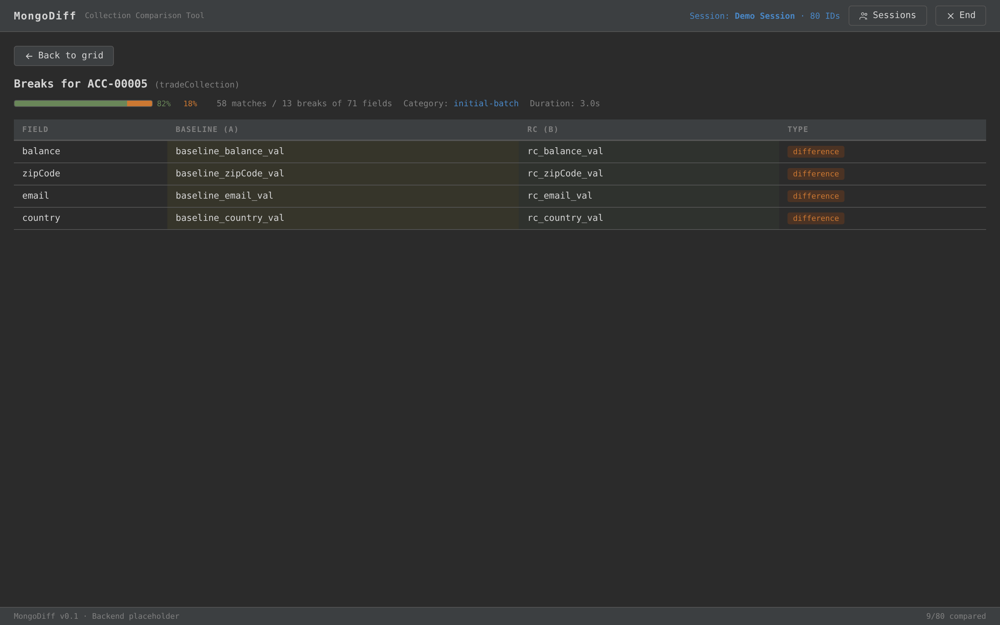
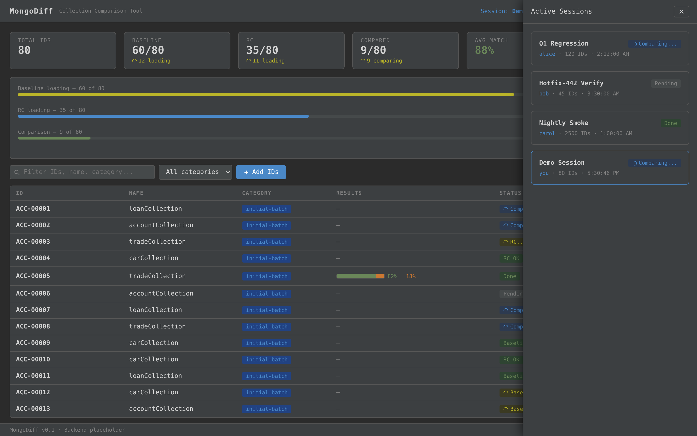

# MongoDiff

[](https://github.com/drompincen/mongodiff/actions/workflows/ci.yml)
[](https://openjdk.org/)
[](https://spring.io/projects/spring-boot)
[](license.txt)

A MongoDB and Java List comparison tool for **regression testing** and **data validation**. Compare two collections or in-memory lists field-by-field, visualize differences in a dark-themed web UI, and export results to Excel.

---

## Features

- **Two comparison modes** — compare MongoDB collections directly or Java lists in-memory (no database required)
- **Merge-join algorithm** — efficient sorted-stream comparison, handles millions of records
- **Field-level diff detection** — identifies exact attributes that differ between matched records
- **Four break types** — `match`, `difference`, `onlyOnA`, `onlyOnB`
- **React web UI** — dark IDE-inspired interface with real-time progress, filtering, sorting, and drill-down
- **Excel export** — color-coded `.xlsx` reports with summary, detail sheets, and smart cell merging
- **Session management** — run multiple comparison sessions, track active sessions across users
- **Built-in sample data** — 215 pre-configured accounts with intentional differences for instant demo

---

## Screenshots

### 1. Start Session Screen

The landing page where you create a new comparison session, load a demo, or load sample data directly from MongoDB or in-memory.



### 2. Results Grid (Comparison Dashboard)

After loading data, the dashboard shows stat cards, real-time progress bars, and a sortable/filterable data grid with match/break percentages and status badges for every record.



### 3. Break Detail View (Drill-Down)

Click any completed record to drill down into the field-by-field comparison. Baseline (A) values are highlighted in yellow, RC (B) values in green, and each difference is tagged by type.



### 4. Active Sessions Sidebar

View all active comparison sessions across your team from the slide-out panel on the right.



---

## Getting Started

### Prerequisites

- **Java 17+** (JDK)
- **Maven 3.6+**
- **MongoDB 4.4+** (optional — only needed for MongoDB-mode comparisons)

### Build

```bash
mvn clean package
```

### Run

```bash
java -jar target/comparison-app-1.0.0.jar
```

Then open **http://localhost:8080** in your browser.

### Quick Start (No MongoDB)

MongoDiff works without a running MongoDB instance. Use the **"Load Mongo Mem"** button on the UI or call the in-memory API endpoint:

```bash
curl -X POST http://localhost:8080/api/sample/load-mem
```

This compares 215 sample accounts entirely in-memory and returns the results to the UI.

---

## Architecture

```
┌──────────────────────────────────────────────────────────┐
│                     Web Browser                          │
│                  (React SPA at /)                        │
└────────────────────────┬─────────────────────────────────┘
                         │ REST API
┌────────────────────────▼─────────────────────────────────┐
│              Spring Boot Application                     │
│  ┌──────────────────────────────────────────────────┐    │
│  │         SampleDataController                      │    │
│  │  POST /api/sample/load        (MongoDB mode)      │    │
│  │  POST /api/sample/load-mem    (in-memory mode)    │    │
│  │  GET  /api/sample/status                          │    │
│  │  GET  /api/sample/breaks/{id}                     │    │
│  └───────────────┬──────────────────────┬────────────┘    │
│                  │                      │                 │
│  ┌───────────────▼───────┐  ┌──────────▼────────────┐    │
│  │GenericComparisonService│  │  ExcelReportService    │    │
│  │                       │  │                        │    │
│  │ compareCollections()  │  │ generateExcelReport()  │    │
│  │ compareLists()        │  │ Summary + Detail sheets│    │
│  └───────────┬───────────┘  └────────────────────────┘    │
│              │                                            │
│  ┌───────────▼───────────┐                                │
│  │     MongoTemplate     │  (optional)                    │
│  └───────────┬───────────┘                                │
└──────────────┼────────────────────────────────────────────┘
               │
       ┌───────▼───────┐
       │   MongoDB      │
       └───────────────┘
```

### Comparison Engine

The `GenericComparisonService` uses a **merge-join** algorithm on sorted data:

1. Both sources are sorted by a key attribute (e.g. `accountId`)
2. Two iterators walk both collections simultaneously
3. When keys match, each specified attribute is compared using `Objects.equals()`
4. When keys don't match, the record is classified as `onlyOnA` or `onlyOnB`
5. Results are stored as `ComparisonBreak` records

This approach is **O(n log n)** for sorting + **O(n)** for the merge pass, making it efficient for large datasets.

---

## API Reference

| Endpoint | Method | Description |
|---|---|---|
| `/api/sample/load` | `POST` | Load 215 sample accounts into MongoDB, compare, return results |
| `/api/sample/load-mem` | `POST` | Same comparison done entirely in-memory (no MongoDB needed) |
| `/api/sample/status` | `GET` | Get the status and results of the last comparison |
| `/api/sample/breaks/{id}` | `GET` | Get field-level breaks for a specific record ID |

### Example: Load In-Memory Sample

```bash
curl -s -X POST http://localhost:8080/api/sample/load-mem | jq '.session'
```

```json
{
  "name": "Sample Comparison",
  "startedAt": "2026-02-28T17:30:00Z",
  "totalIds": 215
}
```

### Example: Get Breaks for a Record

```bash
curl -s http://localhost:8080/api/sample/breaks/acct0001 | jq .
```

```json
[
  {
    "comparisonKey": "acct0001",
    "differenceField": "balance",
    "valueInCollectionA": "1000.0",
    "valueInCollectionB": "1010.0",
    "breakType": "difference"
  }
]
```

### Sample Data Layout

The built-in sample generates **215 accounts** with intentional differences:

| Range | Count | Behavior |
|---|---|---|
| `acct0001` – `acct0030` | 30 | Present in both, **balance differs** (+10.0 in RC) |
| `acct0031` – `acct0200` | 170 | Present in both, **fully matching** |
| `acct0201` – `acct0205` | 5 | **Only in Baseline** (onlyOnA) |
| `acct0301` – `acct0310` | 10 | **Only in RC** (onlyOnB) |

---

## Programmatic Usage

### Compare MongoDB Collections

```java
@Autowired GenericComparisonService comparisonService;

comparisonService.compareCollections(
    Account.class,
    "accountBaseline",          // collection A
    "accountRC",                // collection B
    "accountId",                // key attribute
    List.of("balance", "accountType", "riskLevel"),  // attributes to compare
    "comparisonBreaks"          // output collection
);
```

### Compare Java Lists (No MongoDB)

```java
GenericComparisonService service = new GenericComparisonService();

ListComparisonResult<Account> result = service.compareLists(
    baselineAccounts,           // list A
    rcAccounts,                 // list B
    "accountId",                // key attribute
    List.of("balance", "accountType", "riskLevel")
);

System.out.println(result);
// List Comparison Summary:
//   Items Processed from List A: 205
//   Items Processed from List B: 210
//   Keys Only in List A: 5
//   Keys Only in List B: 10
//   Common Keys Found: 200
//     - Fully Matched Keys: 170
//     - Keys with Attribute Mismatches: 30
//   Total Individual Attribute Differences: 30
```

### Generate Excel Report

```java
@Autowired ExcelReportService excelService;

XSSFWorkbook workbook = excelService.generateExcelReport(
    Account.class,
    "accountId",
    "accountBaseline",
    "accountRC",
    "comparisonBreaks"
);

try (FileOutputStream out = new FileOutputStream("report.xlsx")) {
    workbook.write(out);
}
```

The generated Excel workbook contains four sheets:

| Sheet | Contents |
|---|---|
| **Summary** | Count of each break type (onlyOnA, onlyOnB, difference) |
| **onlyOnA** | Full records that exist only in Baseline |
| **onlyOnB** | Full records that exist only in RC |
| **difference** | Side-by-side values with yellow (A) and green (B) highlighting |

---

## Configuration

**`src/main/resources/application.yaml`**

```yaml
spring:
  data:
    mongodb:
      uri: mongodb://localhost:27017/mongodiff
      auto-index-creation: false

logging:
  level:
    org.springframework: INFO
    com.example.comparison: DEBUG
```

If MongoDB is not available, the application still starts — the in-memory comparison mode works without it.

---

## Testing

Run all in-memory tests (no MongoDB required):

```bash
mvn test -Dtest="GenericComparisonServiceListTest,GenericComparisonServiceLargeScaleTest"
```

Run all tests including embedded MongoDB tests:

```bash
mvn test
```

### Test Suites

| Test Class | What It Covers |
|---|---|
| `GenericComparisonServiceTest` | Core comparison with embedded MongoDB |
| `GenericComparisonServiceListTest` | In-memory list comparison |
| `GenericComparisonServiceLargeScaleTest` | Large dataset handling (1M+ items) |
| `GenericComparisonServiceCarTest` | Comparison with `Car` entity |
| `ExcelReportServiceTest` | Excel report generation |

---

## Project Structure

```
mongodiff/
├── pom.xml
├── src/
│   ├── main/
│   │   ├── java/com/example/comparison/
│   │   │   ├── ComparisonApplication.java          # Spring Boot entry point
│   │   │   ├── controller/
│   │   │   │   └── SampleDataController.java       # REST API
│   │   │   ├── model/
│   │   │   │   ├── Account.java                    # Financial account entity
│   │   │   │   ├── Car.java                        # Vehicle entity
│   │   │   │   ├── ComparisonBreak.java            # Diff result record
│   │   │   │   └── MyEntity.java                   # Generic example
│   │   │   └── service/
│   │   │       ├── GenericComparisonService.java    # Comparison engine
│   │   │       └── ExcelReportService.java          # Excel export
│   │   └── resources/
│   │       ├── application.yaml
│   │       └── static/
│   │           └── index.html                       # React UI (single-file)
│   └── test/
│       └── java/com/example/comparison/
│           ├── GenericComparisonServiceTest.java
│           ├── GenericComparisonServiceListTest.java
│           ├── GenericComparisonServiceLargeScaleTest.java
│           └── service/
│               └── ExcelReportServiceTest.java
└── .github/
    └── workflows/
        └── ci.yml                                   # GitHub Actions CI
```

---

## Tech Stack

| Component | Technology |
|---|---|
| Runtime | Java 17 |
| Framework | Spring Boot 3.2.5 |
| Database | MongoDB (optional) |
| Excel | Apache POI 5.2.3 |
| Frontend | React 18 (CDN, single-file SPA) |
| Testing | JUnit 5 + Flapdoodle Embedded MongoDB |
| CI/CD | GitHub Actions |

---

## License

[MIT](license.txt) -- David Olivares, 2024
